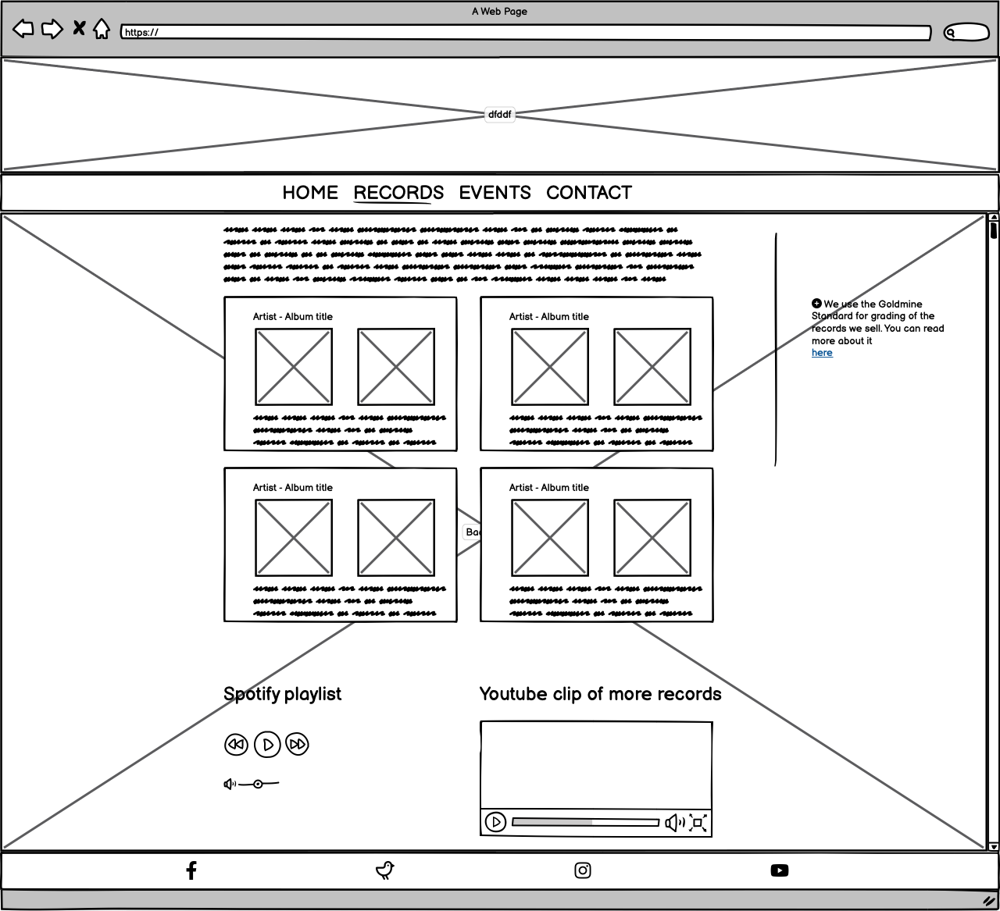
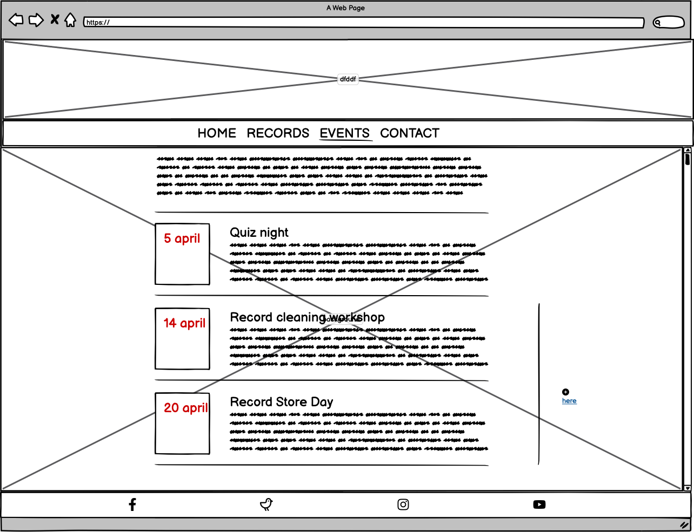
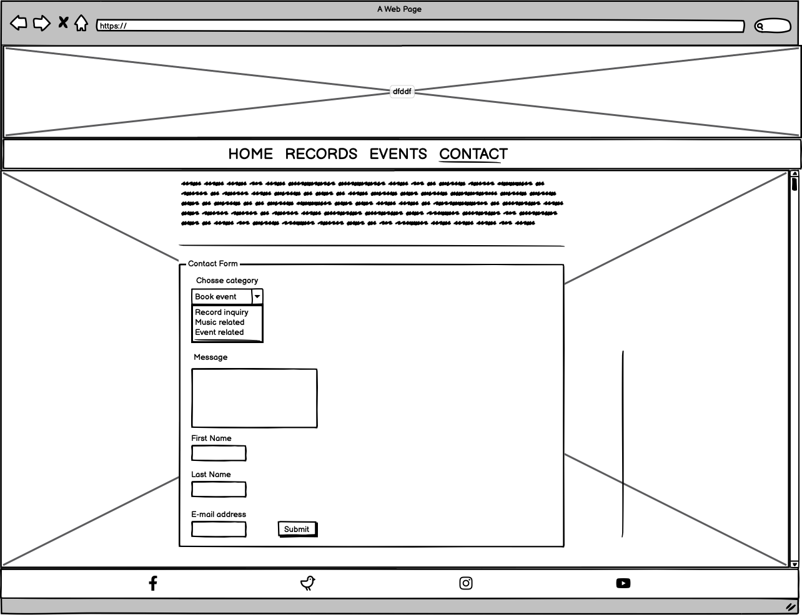
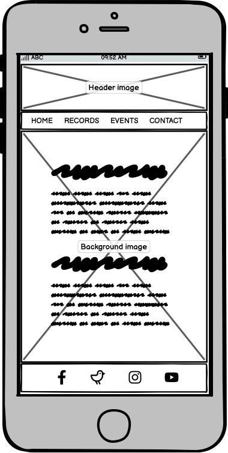
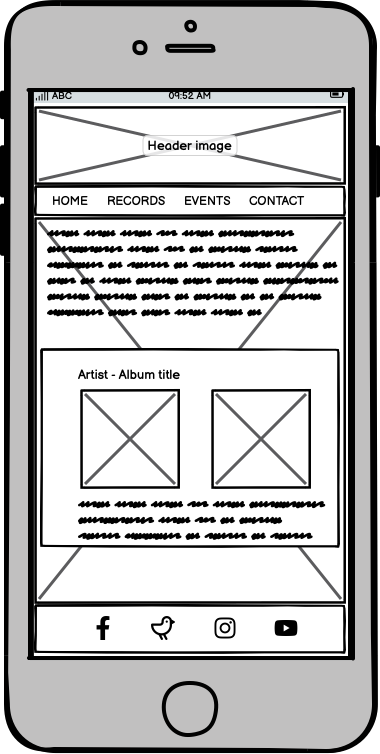
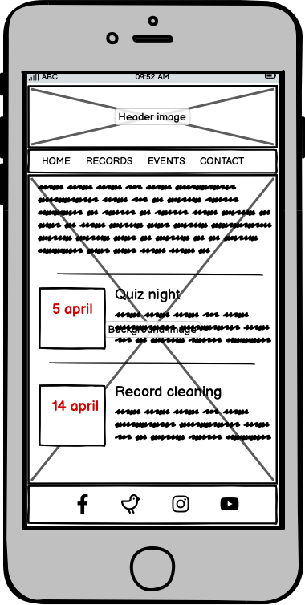
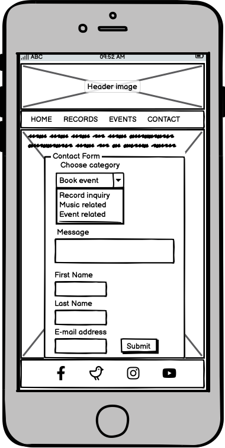

# REAL Records

Real Records is a web site for the imaginary record store with the same name. The purpose of the site is to give the users information of what they can find in the store and what events that are arranged so that they want to visit the store. Another goal is to build a community for people interested in music, both in the store but also online.

The live link can be found here - [REAL Records](https://)

## Site Owner Goals 
- To make the user curious to visit the physical store by:
    - Showing records that can be found in the store
    - Inform users about upcoming events
    - Re-create the same atmosphere on the web site as in the store
-  To make the users wanting to be a part of a community

## User Stories
- ### First time user
  - As a first time user I want to understand the main purpose of the site and how to navigate around it.
  - As a first time user I want to understand what kind of music i can find in the store.
  - As a first time user I want to find information about wow to contact the store and where to find it. 

- ### Returning User
  - As a returning user I want to explore the records section ...
  - As a returning user I want to explore the events section ...
  - As a returning user I want to contact the

- ### Frequent User
  - As a frequent user I want to be able to 
  - 
-  

## Design

### Imagery
The images used on the REAL Records web site are chosen to re-create the atmosphere of the real store. Nice images of vinyl records and vinyl players. 

### Colours
The colors used on the site are mainly black, white and red. Black is the natural and most common color of a vinyl record and therefore seems like a natural choice. It is used as a background color i the navigation bar and in the footer. The use of red text on white background is a hommage to the the rock singer David Bowie and his album 'Station to Station'.  

### Fonts
The xxx font is used for headings and in the nav bar. It's chosen because of it's resemblence to the font used on the album 'Station to Station'.

## Wireframes
Wireframes were produced using Balsamiq. 

 

 
Desktop Wireframe

 

 

    
Mobile Wireframe

 

## Features
- ### Navigation

    - The fully responsive navigation bar 

- ### The Landing Page Image
    - The landing page...

 

- ### Records Page
    - This page
  
- ### Events Page
    - The Events page

- ### Contact page
    - The contact page

 

- ### Footer
    - The footer section 

### Features Left to Implement
- 

## Testing

### Validator Testing
- #### HTML
    - 
- #### CSS
    - 
- #### Accessibility 
    - 

### Form Testing
- The form 

### Links Testing
- 

### Browser Testing
- 
    
### Device Testing
- 

### Friends and Family User Testing

### Fixed Bugs
#### ABug 1
- The 

#### Bug 2
- When I first 

### Known Bugs
HTML Smooth Scroll does not work on Safari browser.

## Technologies Used

### Languages
- HTML5
- CSS

### Frameworks - Libraries - Programs Used
- [Am I Responsive](http://ami.responsivedesign.is/) - Used to verify responsiveness of website on different devices.
- [Responsinator](http://www.responsinator.com/) - Used to verify responsiveness of website on different devices.
- [Balsamiq](https://balsamiq.com/) - Used to generate Wireframe images.
- [Chrome Dev Tools](https://developer.chrome.com/docs/devtools/) - Used for overall development and tweaking, including testing responsiveness and performance.
- [Font Awesome](https://fontawesome.com/) - Used for Social Media icons in footer.
- [GitHub](https://github.com/) - Used for version control and hosting.
- [Google Fonts](https://fonts.google.com/) - Used to import and alter fonts on the page.
- [TinyPNG](https://tinypng.com/) - Used to compress images to reduce file size without a reduction in quality.
- [W3C](https://www.w3.org/) - Used for HTML & CSS Validation.
- 

## Deployment

The project was deployed using GitHub pages. The steps to deploy using GitHub pages are:

1. Go to the repository on GitHub.com
2. Select 'Settings' near the top of the page.
3. Select 'Pages' from the menu bar on the left of the page.
4. Under 'Source' select the 'Branch' dropdown menu and select the main branch.
5. Once selected, click the 'Save'.
6. Deployment should be confirmed by a message on a green background saying "Your site is published at" followed by the web address.

The live link can be found here - 

## Credits

### Content
All content was produced by the author.

### Media

### Resources Used

## Acknowledgments
