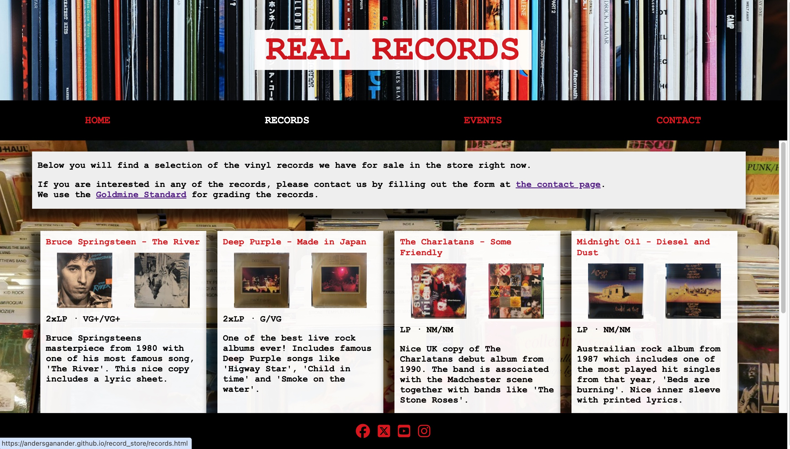

# REAL Records

Real Records is a web site for the imaginary record store with the same name. The purpose of the site is to give the users information of what they can find in the store and what events that are arranged so that they want to visit the store. Another long term goal is to build a community for people interested in music, both in the store but also online.

The live link can be found here - [REAL Records](https://andersganander.github.io/record_store/)

## Site Owner Goals 
- To make the user curious to visit the physical store by:
    - Showing records that can be found in the store
    - Inform users about upcoming events both in the store and elsewhere
    - Re-create the same atmosphere on the web site as in the store

## User Stories
- ### First time user
  - As a first time user I want to understand the main purpose of the site and how to navigate around it.
  - As a first time user I want to understand what kind of music i can find in the store.
  - As a first time user I want to find information about how to contact the store and where to find it. 

- ### Returning User
  - As a returning user I want to explore the records section.
  - As a returning user I want to explore the events section.
  - As a returning user I want to contact the store.

- ### Frequent User
  - As a frequent user I want to be able to find information about newly added records.
  - As a frequent user I want to be able to find information about upcoming events.

## Design

### Imagery
The images used on the REAL Records web site are chosen to re-create the atmosphere of the real store. Nice images of vinyl records and vinyl players. 

### Colours
The colors used on the site are mainly black, white and red. Black is the natural and most common color of a vinyl record and therefore seems like a natural choice. It is used as a background color in the navigation bar and in the footer. 

### Fonts
The font Courier New is used in all texts and alson in headings and links in the nav bar. It's chosen for it's authenticity and it's retro feeling.

The font "DymoFontInvers" is used to create a feeling of a rock/punk attitude and is used in the form on the CONTACT page.

## Wireframes
Wireframes were produced using Balsamiq. 

 

 
Desktop Wireframe

 

 

    
Mobile Wireframe

 

## Features
- ### Navigation

    - The responsive navigation bar contains links to Home, Records, Events and Contact Pages.
    - The active page is marked in the navigation bar with a different color.
    - External pages are opened in a new tab so that user won't be confused.
    - The text on the landing page also contain links to the other pages to make the user aware of what he/she can expect to find on the site. 

- ### The Landing Page
    - The landing page is very straightforward and presents information about the the store and what the user can expect to find on the site.

 

- ### Records Page
    - On the records page the user find a selection of records currently in the store.
    - In the text at the top of the page there are links to the contact page and to an external page which explains the grading standard that is used.
    - Each record is presented on a card with pictures of the front and back covers, a short description of the condition and a longer description.
    - In the nav bar, RECORDS is marked in white to indicate where the user is currently located on the site.

 
  
- ### Events Page
    - The Events page contains information about upcoming events in store. It also contains information about other events that might be of interest for the users.
    - In the text at the top of the page there is a link to the contact page where the user can sign up to participate in an event.
    - Each event is presented with a heading, which includes date and time, and a short description.
    - Some of the event descriptions includes links to external resources. 
    - In the nav bar, EVENTS is marked in white to indicate where the user is currently located on the site.

 

- ### Contact page
    - The contact page consists of a form which the user can fill in.
    - The form contains a drop down with a list of different categorys to choose from, which will make it easier both for the user but also for the site owner.

 
 

- ### Footer
    - The footer section contains links to Facebook, X (formerly known as twitter), YouTube and Instagram.

## Testing

### Validator Testing
- #### HTML
    - The site was tested with W3C Markup Validation Service, without any errors.

- #### CSS
    -  The site was tested with W3C CSS Validator, without any errors.

- #### Accessibility 
    - The site was tested for accessibility with Ligthouse and received a good result.

### User story testing
The tests has been done with Chrome on macOs

### Browser Testing
The site were tested in the most common browsers (Chrome, Firefox, Safari and Edge). Alll browsers were tested on mac os except for Edge which was tested on Windows 11.

    
### Device Testing
In addition to testing responsiness with Am I Responsive and Responsinator the site has also been tested on some ios devices (iPhone SE and iPad). On the smaller iPhone there was an issue with the submit button when viewing the site in Safari (see the Browser testing table for a description of the issue and a workaround).

### Fixed Bugs
All the bugs that were discovered during the development have been documented using GitHub issues. All bugs are fixed.

### Known Bugs
- Issue with submit button in safari on smaller iphones. Workaround available (see browser testing table).

## Technologies Used

### Languages
- HTML5
- CSS

### Frameworks - Libraries - Programs Used
#### Development and design
- [Balsamiq](https://balsamiq.com/) - Used to create wireframes for desktop and mobile.
- [Chrome Dev Tools](https://developer.chrome.com/docs/devtools/) - Used for overall development and testing.
- [GitHub](https://github.com/) - Used for version control and hosting.

#### Testing
- [Am I Responsive](http://ami.responsivedesign.is/) - Used to verify responsiveness.
- [Lighthouse](https://developer.chrome.com/docs/devtools/) - Used for overall accessibility testing from dev tools.
- [Responsinator](http://www.responsinator.com/) - Used to verify responsiveness.
- [W3C](https://www.w3.org/) - Used for validation of HTML and CSS.

## Deployment

The project was deployed using GitHub pages. The steps to deploy using GitHub pages are:

1. Go to the repository on GitHub.com
2. Select 'Settings' near the top right corner of the page.
3. Select 'Pages' from the menu bar on the left of the page.
4. Click the drop down below 'Source' and select 'Deploy from a Branch'.
5. Click the drop down under 'Branch' and select 'main'.
5. Click 'Save'.

At the top of the page there's a section describing the status of your site and when it was last deployed. 
To remove the project from auto-deploy:
Repeat step 1-2 in the above list
3. Click the drop down under 'Branch' and select 'None'.
4. Click 'Save'.

The live link can be found here - [REAL Records](https://andersganander.github.io/record_store/)

## Credits

### Content
All texts was written by the site owner.

### Media
#### Photos
- Photo on EVENTS page from (https://www.pexels.com/@cottonbro/)
- Photo on HOME page and CONTACT page by Adrian Korte on Unsplash
- Photo on RECORDS page by Mick Haupt on Unsplash
- Photo in header on all pages by Samuel Regan-Asante on Unsplash

#### Fonts and icons
- Dymo Font Ivers (used om the CONTACT page) from (https://www.fonts4free.net/dymo-font-invers-font.html
)
- [Font Awesome](https://fontawesome.com/) used for icons in footer and event cards
- [Freefavicon](https://www.freefavicon.com/) used for creating favicon.

### Resources Used
- Love Running walkthrough, especially how to use font awesome in footer.
- [Mmdn](https://developer.mozilla.org/en-US/docs/Web/CSS) for tutorials, tips and tricks
- [w3Schools] (https://www.w3schools.com/) for tutorials, tips and tricks. 
- Code snippet to calculate width from (https://www.w3schools.com/cssref/func_calc.php) 
- Inspiration on how to use box-shadow: https://www.freecodecamp.org/news/html-div-what-is-a-div-tag-and-how-to-style-it-with-css/ 

## Acknowledgments
- I received support and helpful advices from my mentor, Antonio.
- The slack community, where everyone is really helpful and supportive.
