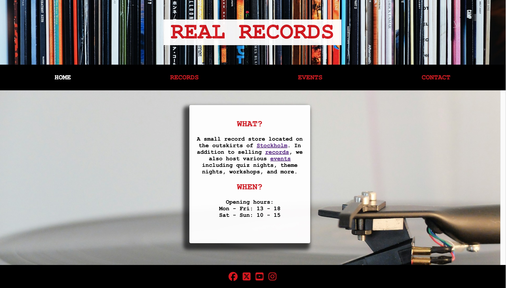
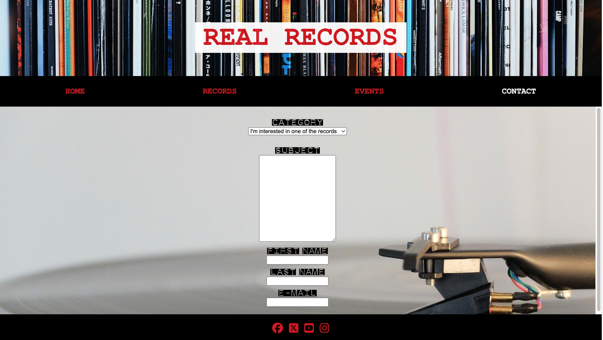

# REAL Records

Real Records is a web site for the imaginary record store with the same name. The purpose of the site is to give the users information of what they can find in the store and what events that are arranged so that they want to visit the store. Another goal is to build a community for people interested in music, both in the store but also online.

The live link can be found here - [REAL Records](https://andersganander.github.io/record_store/)

## Site Owner Goals 
- To make the user curious to visit the physical store by:
    - Showing records that can be found in the store
    - Inform users about upcoming events both in the store and elsewhere
    - Re-create the same atmosphere on the web site as in the store

## User Stories
- ### First time user
  - As a first time user I want to understand the main purpose of the site and how to navigate around it.
  - As a first time user I want to understand what kind of music i can find in the store.
  - As a first time user I want to find information about how to contact the store and where to find it. 

- ### Returning User
  - As a returning user I want to explore the records section.
  - As a returning user I want to explore the events section.
  - As a returning user I want to contact the store.

- ### Frequent User
  - As a frequent user I want to be able to find information about newly added records.
  - As a frequent user I want to be able to find information about upcoming events.

## Design

### Imagery
The images used on the REAL Records web site are chosen to re-create the atmosphere of the real store. Nice images of vinyl records and vinyl players. 

### Colours
The colors used on the site are mainly black, white and red. Black is the natural and most common color of a vinyl record and therefore seems like a natural choice. It is used as a background color i the navigation bar and in the footer. 

### Fonts
The font "DymoFontInvers" is used to create a feeling of a rock/punk attitude and is used for headings and links in the navigation bar.

For the normal text, courier new is used which also create a feeling of D. I. Y. as it reminds of the look of fanzines from the 80's. 

## Wireframes
Wireframes were produced using Balsamiq. 

 

 
Desktop Wireframe

 

 

    
Mobile Wireframe

 

## Features
- ### Navigation

    - The responsive navigation bar contains links to Home, Records, Events and Contact Pages.
    - The active page is marked in the navigation bar with a different color.
    - External pages are opened in a new tab so that user won't be confused.
    - The text on the landing page also contain links to the other pages to make the user aware of what he/she can expect to find on the site. 

- ### The Landing Page
    - The landing page is very straightforward and presents information about the subject. 

 

- ### Records Page
    - On the records page the user find a selection of records currently in the store.
    - In the text at the top of the page there are links to the contact page and to an external page which explains the grading standard that is used.
    - Each record is presented on a card with pictures of the front and back covers, a short description of the condition and a longer description.
    - In the nav bar, RECORDS is marked in white to indicate where the user is currently located on the site.

 
  
- ### Events Page
    - The Events page contains information about upcoming events in store. It also contains information about other events that might be of interest for the users.
    - In the text at the top of the page there is a link to the contact page where the user can sign up to participate in an event.
    - Each event is presented with a heading, which includes date and time, and a short description.
    - Some of the event descriptions includes links to external resources. 
    - In the nav bar, EVENTS is marked in white to indicate where the user is currently located on the site.

 

- ### Contact page
    - The contact page

 

- ### Footer
    - The footer section 

404 and favicon?

### Features Left to Implement
- 

## Testing

### Validator Testing
- #### HTML
    - 
- #### CSS
    - 
- #### Accessibility 
    - 

### Form Testing
- The form 

### Links Testing
- 

### Browser Testing
- 
    
### Device Testing
- 

### Friends and Family User Testing

### Fixed Bugs

#### ABug 1
- The 

#### Bug 2
- When I first 

### Known Bugs
HTML Smooth Scroll does not work on Safari browser.

## Technologies Used

### Languages
- HTML5
- CSS

### Frameworks - Libraries - Programs Used
- [Am I Responsive](http://ami.responsivedesign.is/) - Used to verify responsiveness of website on different devices.
- [Responsinator](http://www.responsinator.com/) - Used to verify responsiveness of website on different devices.
- [Balsamiq](https://balsamiq.com/) - Used to generate Wireframe images.
- [Chrome Dev Tools](https://developer.chrome.com/docs/devtools/) - Used for overall development and tweaking, including testing responsiveness and performance.
- [Font Awesome](https://fontawesome.com/) - Used for Social Media icons in footer.
- [GitHub](https://github.com/) - Used for version control and hosting.
- [Google Fonts](https://fonts.google.com/) - Used to import and alter fonts on the page.
- [W3C](https://www.w3.org/) - Used for HTML & CSS Validation.
- 

## Deployment

The project was deployed using GitHub pages. The steps to deploy using GitHub pages are:

1. Go to the repository on GitHub.com
2. Select 'Settings' near the top of the page.
3. Select 'Pages' from the menu bar on the left of the page.
4. Under 'Source' select the 'Branch' dropdown menu and select the main branch.
5. Once selected, click the 'Save'.
6. Deployment should be confirmed by a message on a green background saying "Your site is published at" followed by the web address.

The live link can be found here - 

## Credits

### Content
All content was produced by the author.

### Media

### Resources Used

## Acknowledgments
